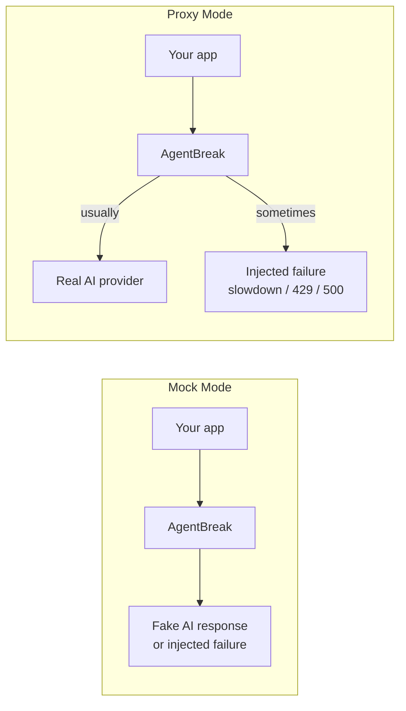

# AgentBreak

AgentBreak helps you test what your app does when an AI provider is slow, flaky, or down.

In simple terms:

- put AgentBreak between your app and OpenAI-compatible APIs
- tell AgentBreak to randomly fail some requests, slow some down, or return rate limits
- see whether your app retries, falls back, or breaks

This is useful because provider outages are normal, not rare.



Provider outages, slowdowns, rate limits, and partial failures happen regularly. That is the reason this tool exists: you should be able to test them before your users find them for you.

If you know Toxiproxy, AgentBreak is the same basic idea for LLM APIs: it injects OpenAI-style failures, latency, and weighted fault scenarios so you can test retries, fallbacks, and resilience logic.

AgentBreak can run in two modes:

- `proxy`: send requests to the real provider, but occasionally simulate failures on the way
- `mock`: do not call a real provider; return a tiny fake response unless a failure is injected

When you stop it, AgentBreak prints a simple scorecard showing how your app handled those failures.

## Quick Start

Fastest way to try it, with no real provider needed:

```bash
pip install -e .
agentbreak start --mode mock --scenario mixed-transient --fail-rate 0.2
```

Then point your app at AgentBreak instead of directly at OpenAI:

```bash
export OPENAI_BASE_URL=http://localhost:5000/v1
```

## Install

```bash
pip install -e .
```

Run it with:

```bash
agentbreak start --mode mock --scenario mixed-transient --fail-rate 0.2
```

Run tests with:

```bash
pip install -e '.[dev]'
pytest -q
```

## Config

AgentBreak will automatically load `config.yaml` from the current directory if it exists.

You can also pass a custom file:

```bash
agentbreak start --config agentbreak.yaml
```

CLI flags override YAML values.

You can also set `request_count` in `config.yaml` for the included example apps. They will send that many requests to AgentBreak unless `AGENTBREAK_REQUEST_COUNT` is set.

Quick start:

```bash
cp config.example.yaml config.yaml
agentbreak start
```

See `config.example.yaml`.

## Real Provider Mode

```bash
agentbreak start --mode proxy --upstream-url https://api.openai.com --scenario mixed-transient --fail-rate 0.2
```

This forwards traffic to the real provider, but injects failures along the way.

Point your app at AgentBreak:

```bash
export OPENAI_BASE_URL=http://localhost:5000/v1
```

## Fake Provider Mode

```bash
agentbreak start --mode mock --scenario mixed-transient --fail-rate 0.2
```

This never calls a real provider. It is useful for local testing, demos, and retry logic checks.

For SDKs that require an API key even in mock mode, use any dummy value:

```bash
export OPENAI_API_KEY=dummy
```

## Exact Failure Mix

If you want a very specific test, you can choose the exact mix of failures:

```bash
agentbreak start --mode proxy --upstream-url https://api.openai.com --faults 500=0.30,429=0.45
```

That means:

- `30%` of requests get `500`
- `45%` of requests get `429`
- the rest pass through normally

AgentBreak currently:

- handles `POST /v1/chat/completions`
- can inject `400, 401, 403, 404, 413, 429, 500, 503`
- can inject latency
- tracks duplicate requests
- prints a resilience scorecard on shutdown

```bash
curl http://localhost:5000/_agentbreak/scorecard
curl http://localhost:5000/_agentbreak/requests
```

## Reading The Scorecard

The scorecard is a quick signal, not a perfect pass/fail oracle.

- `duplicate_requests` means AgentBreak saw the same request body more than once
- `suspected_loops` means AgentBreak saw the same request body at least three times

That can indicate a real problem such as:

- a retry loop with no backoff
- an app resending the same request after an error
- a framework getting stuck and replaying work

But it can also happen during normal agent execution. Some agent frameworks make repeated underlying completion calls while planning, using tools, or recovering from intermediate steps.

So:

- treat high duplicate counts as a clue to inspect
- use `/_agentbreak/requests` to see what was repeated
- do not assume every duplicate is a bug

## Scenarios

- `mixed-transient`
- `rate-limited`
- `provider-flaky`
- `non-retryable`
- `brownout`

## Examples

Run the simple LangChain example:

```bash
cd examples/simple_langchain
pip install -r requirements.txt
OPENAI_API_KEY=dummy OPENAI_BASE_URL=http://localhost:5000/v1 python main.py
```

More examples: `examples/README.md`.

## Codex Skill

A repo-local Codex skill is included at `skills/agentbreak-testing/SKILL.md`.

## Install The Skill

If you already cloned this repo, install the skill into Codex by copying it into your local skills directory:

```bash
mkdir -p ~/.codex/skills/agentbreak-testing
cp skills/agentbreak-testing/SKILL.md ~/.codex/skills/agentbreak-testing/SKILL.md
```

Then restart Codex so it reloads local skills.

## Use The Skill

Ask for it in plain English by name. For example:

```text
Use the agentbreak-testing skill to run the simple_langchain example in mock mode with request_count 10.
```

Or:

```text
Use the agentbreak-testing skill to run proxy mode against https://api.openai.com and summarize the scorecard.
```

You can also ask more generally:

- `Use the agentbreak-testing skill to test my app against rate limits.`
- `Use the agentbreak-testing skill to run AgentBreak in mock mode and inspect the scorecard.`
- `Use the agentbreak-testing skill to run the simple_langchain example with request_count 10.`

What the skill does:

- starts AgentBreak in `mock` or `proxy` mode
- points your app at `OPENAI_BASE_URL`
- runs your target command or example app
- checks `/_agentbreak/scorecard` and `/_agentbreak/requests`
- summarizes resilience signals like retries, duplicates, and failures

This repo is a local single-skill repo, not a published multi-skill registry like [truefoundry/tfy-agent-skills](https://github.com/truefoundry/tfy-agent-skills). So the install flow here is a local copy, not `npx skills add ...`.

Get started locally:

```bash
python3 -m venv .venv
source .venv/bin/activate
pip install -e '.[dev]' -r examples/simple_langchain/requirements.txt
cp config.example.yaml config.yaml
agentbreak start --mode mock --scenario mixed-transient --fail-rate 0
```

## Project Status

AgentBreak is currently an early-stage developer tool. Expect the API surface and scorecard heuristics to evolve.

## Contributing

See `CONTRIBUTING.md`.

## Security

See `SECURITY.md`.

## License

MIT. See `LICENSE`.
